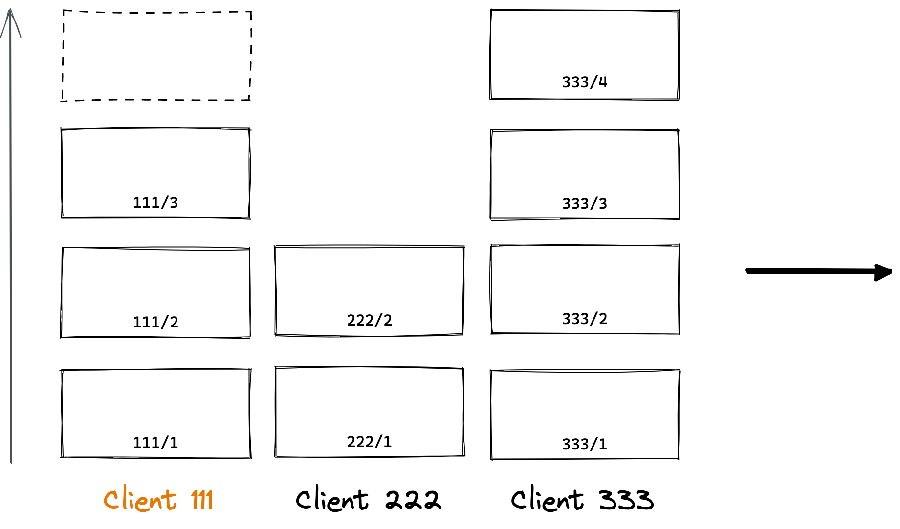

# わかった気になる<br/>CRDT を使った共同編集

<div class="pt-12">
  <span @click="$slidev.nav.next" class="px-2 py-1 rounded cursor-pointer" hover="bg-white bg-opacity-10">
    KentoMoriwaki / Henry, inc.
  </span>
</div>

<div class="abs-br m-6 flex gap-2">
  <button @click="$slidev.nav.openInEditor()" title="Open in Editor" class="text-xl icon-btn opacity-50 !border-none !hover:text-white">
    <carbon:edit />
  </button>
  <a href="https://github.com/slidevjs/slidev" target="_blank" alt="GitHub"
    class="text-xl icon-btn opacity-50 !border-none !hover:text-white">
    <carbon-logo-github />
  </a>
</div>

<!--
The last comment block of each slide will be treated as slide notes. It will be visible and editable in Presenter Mode along with the slide. [Read more in the docs](https://sli.dev/guide/syntax.html#notes
これ編集できるの？
-->

---

# 背景とゴール

- アプリケーション開発をしていると「この機能を共同編集にしたいな」っていう場面はよくある。
- 「でも作ったことないし、ロジックも複雑そうだな」とハードルが高くて、優先度を上げられない。

## 「自分も作れそう」と思ってほしい

その中でも OT がよく紹介されていて、CRDT はあまり情報がなかったりするので OT を選択することが多いが、CRDT も現実的な選択肢であることを知ってほしい

<!--
You can have `style` tag in markdown to override the style for the current page.
Learn more: https://sli.dev/guide/syntax#embedded-styles
-->

<style>
h1 {
  /*  */
}
</style>

---
layout: image-right
image: https://source.unsplash.com/collection/94734566/1920x1080
---

# 今作っているもの

Henry では、Web ベースの電子カルテを作っています。

- 多機能なブロックの埋め込み
- 編集履歴
- 複数人での共同編集
- Draft.js からの移行

---
layout: section
---

# 共同編集を支える技術

## OT と CRDT

---

# データの一貫性を保つ技術

- 複数人のユーザーが一つの文書を操作したときに、全ての操作がそれぞれのユーザーに行き渡ったときに、全てのユーザーが見ている文書が全く同じであることが求められる
  - 同じ場所に同時に文字を入れても、文字の順番が入れ替わってはいけない

いくつも技術があるが、ここでは最も多く使われているであろう OT と、今回紹介したい CRDT を説明する

---

# 1. OT

Operational transformation

シンプルなテキストを共同編集するための技術で、30年ほどの歴史がある。

簡単にいうと、何文字目にどういう操作をしたのかの歴史を持っておくことで、このタイミングで5文字目に文字を挿入したってことは、その間にそれより前に3文字挿入されているから、8文字目に挿入するのが正解だな、という計算を行うこと。

- 直感的で素直な実装だが、複雑なデータ構造や操作を扱おうとすると、どんどん実装が複雑になってしまう
- 基本的には中央サーバーが必要

---

# 1. OT

OT の挙動を step by step で理解できるサイト https://operational-transformation.github.io/


---

# 2. CRDT

Conflict-free replicated data type

そもそもコンフリクトしないようなデータ型を定義することで一貫性を保つ仕組み

10年ほどの歴史の比較的新しい技術だが、データサイズや計算速度の懸念点があったが、技術とコンピューティングの進化で実用的になった

- 汎用的で、組み合わせで複雑なデータにも対応しやすい
- 中央サーバーなしで P2P でのやりとりが可能

データ構造の詳細などは、後ほど説明する

---

# 2. CRDT

CRDT やるなら読んでおきたい https://josephg.com/blog/crdts-are-the-future/


<!--
「なぜ CRDT が俺たちの魂を震えさせるのか」的な記事
-->

---

# OT と CRDT の使い分け

一概に、こういう場合はこちらがいいとは言い切れないが、目安として

- シンプルなテキストデータだけなら OT が最適
- それ以外の複雑なデータが含まれる場合は **CRDT を検討する価値がある**
- 中央サーバーなしで、 P2P でやりとりしたければ CRDT

Henry では、文書内に埋め込みできるデータがリッチであったり、多様なコンテンツを共同編集可能にしたかったため、 CRDT を検討して採用した。

---

# CRDT を使った事例

### [CodeSandbox](https://codesandbox.io/)

コードエディタ部分は OT で、ファイルシステムなどは CRDT と、模範的な使い分け

### [Figma](https://figma.com/)

独自実装の CRDT を使っている https://www.figma.com/ja/blog/how-figmas-multiplayer-technology-works/

### [JupyterLab](https://jupyterlab.readthedocs.io/en/stable/)

今回紹介する Yjs を使った CRDT で共同編集を実装

### [Redis](https://redis.io/)

地理分散システムに CRDT が使われている https://redis.com/blog/diving-into-crdts/

CRDT を使った分散 DB は複数存在している

---
layout: section
---

# ライブラリの紹介

## Yjs と周辺ライブラリ

---

# ライブラリの紹介

周辺のライブラリを合わせて説明することで、 Yjs はどういう責務を担っているかを説明する

<figure>
  
  <figcaption>
    Yjs / ProseMirror / y-prosemirror / lib0 の関係
  </figcaption>
</figure>

---

# Yjs

https://docs.yjs.dev/

CRDT の JavaScript 実装の一つで、Map / Array / XML など汎用的なデータ型が提供されている

内部の構造や挙動は後のページで紹介する

<figure>

```ts {all|1-3|5-7|9|11-15}
import * as Y from "yjs";

const ydoc = new Y.Doc(); // ドキュメントの作成

ydoc.on("update", (update: Uint8Array) => {
  // 変更イベントを受け取り、変更内容をサーバーや他のクライアントに送ることができる
});

const map = ydoc.getMap("foo"); // Top-level に foo という名前の Map を定義する

ydoc.transact(() => { // 複数の変更をひとまとめにするための Transaction の発行
  map.set("one", 1); // "one" のキーに、 1 の値を設定
  map.set("two", new Y.Array()); // "two" のキーに、配列の値を設定
  map.get("two").push(2); // "two" のキーに、 2 を push
});
```

<figcaption> Yjs のサンプルコード </figcaption>
</figure>

---

# ProseMirror

https://prosemirror.net/

WYSIWYG エディタのライブラリ

エディタライブラリは様々あるが、 Yjs と使うなら binding が用意されているものがオススメ

他にも [Quill](https://quilljs.com/) / [Slate](https://www.slatejs.org/) / [Lexical](https://lexical.dev/) なども選択肢で、日本語 IME の対応、モバイル対応、API の使いやすさなど、プロトタイプしながら自身のアプリケーションの要件を満たすかを検討する

### Tiptap

https://tiptap.dev/

ProseMirror を React で使いやすくするためのライブラリ

エディタ内に React や Vue の Component を埋め込めるようにするために便利だが、ProseMirror 自体を理解していないと使うのは難しいので、必須ではない

<style>
h3 {
  margin-top: 25px;
}
h3 + p {
  margin-top: 12px;
  opacity: 0.5;
}
</style>

---

# y-prosemirror

https://github.com/yjs/y-prosemirror

Yjs と ProseMirror の状態を同期してくれるライブラリ

これを使えば、基本的にはエディタの機能を開発するときは ProseMirror のことだけを考えれば良いが、以下の点に注意する必要がある

- 両者の操作を相互に変換して適用するのではなくて、差分を検知して埋めるアルゴリズムのため、実際にエディタで操作したのとは違う形で Yjs に変更が加えられることがある
- ProseMirror と Yjs のデータ構造には完全な互換性はないので、同期すると壊れる可能性がある
  - 例えば、同じ場所に同じ名前の Mark を複数つけることはできない

---

# lib0

https://github.com/dmonad/lib0

Yjs の作者が作っている便利ライブラリで、Yjs 内で主に encoding と decoding の用途に使われている

軽量化のために、ネットワークでやりとりされるデータや永続化するデータなどは、ほぼ全てこの lib0 で作られたバイナリ (Uint8Array) なので、パッとみたときにどういうデータがやりとりされているか分からなくてデバッグに困ることがある

次のページの基本的な使い方と、後で紹介する Yjs でよく使われるデータの意味と構造を知っていれば、開発しやすくなる

---

# lib0

JSON と違って、エンコードする側とデコードする側の両方が、どういう順序でどういうデータが入っているかを知っている必要がある

<figure>

```js {all|1-4|6-10|11-13|14-18}
import encoding from "lib0/encoding";
import decoding from "lib0/decoding";

const data = ["foo", "bar", "baz"]; // 今回エンコードしたいデータ

const encoder = encoding.createEncoder(); // encoder を作る
encoding.writeVarUint(encoder, data.length); // 最初に data の長さを詰めておく
for (const str of data) {
  encoding.writeVarString(encoder, str); // 前から順番に、文字列を詰めていく
}
const message = encoding.toUint8Array(encoder); // バイナリ(Uint8Array) を出力する
// 他のクライアントに message を渡すことを想定
const decoder = decoding.createDecoder(message); // 受け取ったバイナリから decoder を作る
const length = decoding.readVarUint(decoder); // 最初に data 配列の長さを読み取る
for (const i = 0; i < length; i++) { // 読み取った長さ分だけループする
  const str = decoding.readVarString(decoder); // 文字列を読み取る
  assert(str === data[i]); // 元の配列を同じデータが入っていることを確認
}
```

<figcaption>lib0 のサンプルコード</figcaption>
</figure>

---
layout: section
---

# 内部構造と基本的な操作

どういう操作をすると、どのようなデータがやりとりされるのかを理解する

---

# CRDT の内部構造

StructStore → Tree → XML の 3層構造

エディタから見たらただの XML を操作しているように見えるが、その裏側に2つの層がある

<figure class="mt-15">
  
  <figcaption>
    3つの層のイメージ図
  </figcaption>
</figure>

---

# 中心の Tree

一つ一つの操作をノード(=Item)とする木構造

- 各要素が Parent / Left / Right への参照をもつ木構造
  - p タグの先頭の "A" の次に "b" と入力したら、Parent に p タグが、 Left に文字 "A" が入る
  - (効率化のために連続する文字が一つの要素に入る場合もある)

<figure class="mt-4">
  
  <figcaption>
    Parent / Left / Right への参照をもつ木構造
  </figcaption>
</figure>

---

# StructStore にデータを蓄積

Tree の各要素である Item をクライアントごとに順番に積み上げたもの

<!-- `type StructStore = new Map<number, Item[]>` -->

- 各 Item は ID = { clientID, clock } を持つ
  - クライアントごとに初期化時にランダムな数字で clientID が振られ、操作ごとに clock が1ずつ増える。Parent などはそれぞれ参照先の ID として持つ。
- これを integrate することで、 Tree が得られる

<figure class="mt-4">
  
  <figcaption>
    StructStore(各要素がItem)、今の clientID は 111
  </figcaption>
</figure>

---

# 追記 の挙動

- 自身の clientID に操作を追記していく
- 追記した分のデータを他の Client に送る
- ClientStruct と呼ぶ

ネットワークで二つの client が繋がっていることを想定する

Client-Server 方式や、 P2P など幅広い選択肢が取れる。

二つの Client(Server) がある時、両者が同じデータを持っている状態にするプロトコル。

---

# 削除

- これだけ追記じゃなくて、削除フラグを立てることになっている
- DeleteSet の説明

追記していくだけと書いたが、主にパフォーマンスの観点から、削除は追記じゃない。

削除された要素に、削除フラグを立てる。

なので、削除されたデータは残り続けるので、Garbage collection する必要がある（後述）。

## DeleteSet の構造

ここからここは削除しました、というデータ。

---

# Update

追記と削除をまとめたものの名称

基本的には、これがネットワーク上を飛び交う。

`Y.logUpdate` で中身を確認できる。

---

# 同期

初回の読み込みや、再接続時に完全にデータを同期するプロトコルは？

素直にやるなら、両方のデータを merge すればよさそうだが、状態の全てを送り合うのは無駄が多いので、差分だけ送れる仕組みがある。

## StateVector の説明

わたしはこれだけの状態を持っています、を表すデータ。

---

# 同期プロトコルの図


図の簡略化のために一方向だけ書いたが、両者が同時に sync1 を送信する

同期が完了したら、あとはその都度変更を送信しあう。

---

# データの永続化

今のままでは、メモリ上に展開されているデータだけなので、リロードしたり再起動したら消えてしまう。

保存はすごく単純で、全ての状態を Update として書き出すだけ。

リストアは、その Update を適用すれば良いだけ。


---

# 編集履歴

State の特定の地点を表すデータ。これがあれば、その地点の状態まで戻ることができる。

## StateVector との違い

StateVector は削除された範囲に関する情報を持っていないため、その状態に完全に戻ることはできない。

Snapshot = StateVector + DeleteSet

---

# Garbage Collection

先述した通り、削除の操作は削除フラグを付けるだけで、データはずっと残っている。
それにより Snapshot があれば、完全に特定の状態を再現することができる。

しかしそれだとデータがどんどん肥大化してしまい、転送が遅くなったり、操作が遅くなってしまう。
そこで、削除された要素の中身を消去して圧縮することができる。

```ts
const ydoc = new Y.Doc({ gc: true })
```

処理速度とメモリのトレードオフ

基本方針
- クライアントのようは揮発性の高いデータは、 GC を使わない。もちろんメモリがシビアな場合はやってもよい。Undo のデータも保持するので、GC は効果が小さい。
- サーバーサイドでそのまま永続化するようなデータに関しては GC しておかないと、どんどんゴミデータが溜まって肥大化する

---

# Garbage Collection

Snapshot も使いながら、 Garbage Collection するなら、オンデマンド実行がおすすめ。

```ts
function gc(ydoc: Y.Doc): Uint8Array {
  assert(!ydoc.gc);
  const tmpDoc = new Y.Doc({ gc: true });
  Y.applyUpdate(tmpDoc, Y.encodeStateAsUpdate(ydoc));
  return Y.encodeStateAsUpdate(tmpDoc);
}
```

保存する前など任意のタイミングで実行して、元のデータとは別の場所に保存しておく。

---

# Format v1/v2

二種類のメッセージのフォーマットのバージョンが存在している。

内部の Tree の状態などは同じで、ただ単に encode / decode するメッセージのフォーマットが違うだけ。
なので、同じ Doc に v1 と v2 のメッセージを適用しても問題ないが、そのメッセージがどちらのフォーマットなのかは知っておく必要がある。
メッセージ自体も相互変換は可能だが、コストがかかるので、どちらかに合わせる。
デフォルトは v1 なので、v2 の方が高パフォーマンスなので、v2 を使う。
何も考えずにサンプルとか、関連ライブラリを使うと v1 を使うことになるので気をつける。

```js
const v1 = Y.encodeStateAsUpdate(ydoc);
const v2 = Y.encodeStateAsUpdateV2(ydoc);
Y.applyUpdate(ydoc, v1);
Y.applyUpdateV2(ydoc, v2);
```

# その他の注意点

ユーザーの一般的な操作に操作に対して最適化されているので、変な操作をするロジックを書くとめっちゃ遅くなることがある。

例えば、一度の transaction で大量の範囲を書き換えるなど。

---

# Yjs の未来

基本的な機能はできているし、パフォーマンスも十分に高速。
特定の操作を高速化する改善などが進んでいる（要素の Move など）。

また多数の繰り返し処理が行われて v8 の最適化に依存して処理速度が大きく変わったりする。

安定して高パフォーマンスが出せたり、別の言語でも binding できるように Rust(WebAssembly)化が進んでいる。

Yjs のメッセージと互換性がある Rust 実装の yrs の開発が進んでいて、より多くの場面で採用できる幅が広がる。

---

# まとめ

自分が CRDT(Yjs) を使った開発を始める前に知っていたかった知識をまとめた

- 単純なテキスト以上の複雑なデータを共同編集したい場合や、 P2P にしたい場合は　CRDT が有力な選択肢になる
- CRDT は Parent / Left / Right への参照を持った木構造への操作を蓄積したもの
- State(Update) / ClientSet / DeleteSet / StateVector / Snapshot などのデータ構造と意味を理解しておく
- ProseMirror <-> Yjs は自動だが、予期せぬ挙動を起こす場合がある。
- Garbage Collection を有効にするかどうかは場面に応じて検討する。
- yrs に期待

---

# 最後に

- サーバーサイドも色々とトピックがあるので、どこかで話したい。
- ぜひお声がけください


---
layout: center
class: text-center
---

# Learn More

[Documentations](https://sli.dev) · [GitHub](https://github.com/slidevjs/slidev) · [Showcases](https://sli.dev/showcases.html)
